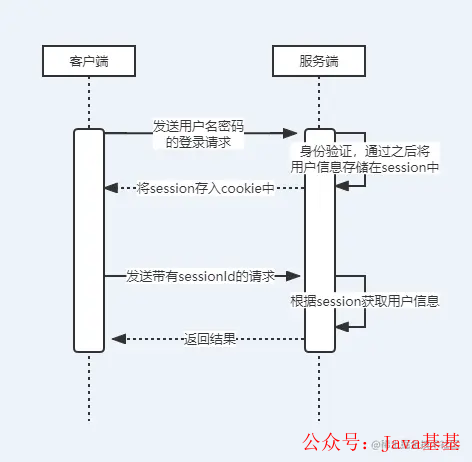
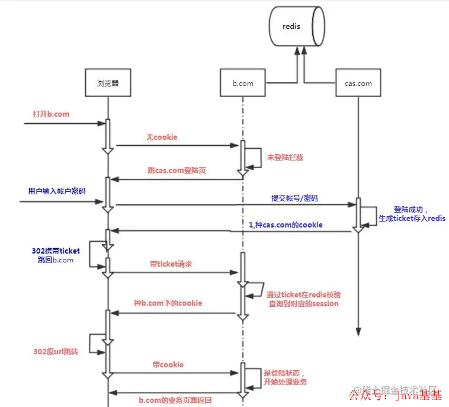

>>> 1.基于 session 的身份认证流程
>>>> 

```
@PostMapping(value = "/login")
public String login(UserRequest request, HttpSession session, Model model,
                    HttpServletResponse response) {
  if (Objects.isNull(request) || isBlank(request.getUsername()) ||
      isBlank(request.getPassword())) {
    model.addAttribute("msg", "账号或密码为空");
    return "login";
  }
  try {
    User user = authenticationService.authentication(request);
    String userSessionId = RandomUtil.getRandom().nextInt(10000) + "_user";
    session.setAttribute(userSessionId, user);
    Cookie cookie = CookieUtil.addUserCookie(userSessionId);
    response.addCookie(cookie);

    return "redirect:hello";
  } catch (Exception e) {
    model.addAttribute("msg", e.getMessage());
  }
  return "login";
}


@RequestMapping(value = "logout")
public String logout(HttpSession session) {
  session.invalidate();
  return "login";
}
```
```
  @RequestMapping(value = "/r/r1")
  public String r1(HttpServletRequest request, Model model) {
    String userSessionId = CookieUtil.getUserCookie(request);
    HttpSession session = request.getSession();
    User user = (User) session.getAttribute(userSessionId);
    String fullName = Objects.nonNull(user) ? user.getFullname() : "匿名";
    model.addAttribute("text", fullName + " 访问资源1");

    return "resource";
  }

```
```java
@Component
public class SimpleAuthenticationInterceptor implements HandlerInterceptor {

  @Override
  public boolean preHandle(HttpServletRequest request, HttpServletResponse response, Object handler)
      throws Exception {
    String userSessionId = CookieUtil.getUserCookie(request);
    Object attribute = request.getSession().getAttribute(userSessionId);
    if (Objects.isNull(attribute)) {
      writeContent(response, "请先登录");
    }
    User user = (User) attribute;
    String requestURI = request.getRequestURI();
    if (user.getAuthorities().contains("p1") && requestURI.contains("r1")) {
      return true;
    }
    if (user.getAuthorities().contains("p2") && requestURI.contains("r2")) {
      return true;
    }
    if (requestURI.contains("resource")) {
      return true;
    }

    writeContent(response, "权限不足，无法访问");
    return false;
  }

  private void writeContent(HttpServletResponse response, String msg) throws IOException {
    response.setContentType("text/html;charset=UTF-8");
    PrintWriter writer = response.getWriter();
    writer.print(msg);
    writer.close();
    response.resetBuffer();
  }
}

```

```
@Autowired
private SimpleAuthenticationInterceptor simpleAuthenticationInterceptor;

@Override
public void addInterceptors(InterceptorRegistry registry) {
  registry.addInterceptor(simpleAuthenticationInterceptor).addPathPatterns("/r/**");
}

```
```java
public class CookieUtil {


  public static Cookie addUserCookie(String cookieValue) {
    return addCookie("user_session_id", cookieValue);
  }

  public static Cookie addCookie(String cookieName, String cookieValue) {
    Cookie cookie = new Cookie(cookieName, cookieValue);
    cookie.setMaxAge(3600);
    cookie.setPath("/");
    return cookie;
  }

  public static String getUserCookie(HttpServletRequest request) {
    return getCookie(request, "user_session_id");
  }

  public static String getCookie(HttpServletRequest request, String cookieName) {
    Cookie[] cookies = request.getCookies();
    String cookieValue = "";
    for (Cookie cookie : cookies) {
      if (cookieName.equals(cookie.getName())) {
        cookieValue = cookie.getValue();
      }
    }
    return cookieValue;
  }

}

```  
>>> CAS 实现单点登录流程
>>>>
```java
public class SSOFilter implements Filter {
    private RedisTemplate redisTemplate;

public static final String USER_INFO = "user";

public SSOFilter(RedisTemplate redisTemplate){
    this.redisTemplate = redisTemplate;
}
@Override
public void init(FilterConfig filterConfig) throws ServletException {

}

@Override
public void doFilter(ServletRequest servletRequest,
                     ServletResponse servletResponse, FilterChain filterChain)
        throws IOException, ServletException {

    HttpServletRequest request = (HttpServletRequest) servletRequest;
    HttpServletResponse response = (HttpServletResponse)servletResponse;

    Object userInfo = request.getSession().getAttribute(USER_INFO);;

    //如果未登陆，则拒绝请求，转向登陆页面
    String requestUrl = request.getServletPath();
    if (!"/toLogin".equals(requestUrl)//不是登陆页面
            &amp;&amp; !requestUrl.startsWith("/login")//不是去登陆
            &amp;&amp; null == userInfo) {//不是登陆状态

        String ticket = request.getParameter("ticket");
        //有票据,则使用票据去尝试拿取用户信息
        if (null != ticket){
            userInfo = redisTemplate.opsForValue().get(ticket);
        }
        //无法得到用户信息，则去登陆页面
        if (null == userInfo){
            response.sendRedirect("http://127.0.0.1:8080/toLogin?url="+request.getRequestURL().toString());
            return ;
        }

        /**
         * 将用户信息，加载进session中
         */
        UserForm user = (UserForm) userInfo;
        request.getSession().setAttribute(SSOFilter.USER_INFO,user);
        redisTemplate.delete(ticket);
    }

    filterChain.doFilter(request,servletResponse);
}

@Override
public void destroy() {

}
}
```
```java
@Controller
public class IndexController {
    @Autowired
    private RedisTemplate redisTemplate;

@GetMapping("/index")
public ModelAndView index(HttpServletRequest request) {
    ModelAndView modelAndView = new ModelAndView();
    Object userInfo = request.getSession().getAttribute(SSOFilter.USER_INFO);
    UserForm user = (UserForm) userInfo;
    modelAndView.setViewName("index");
    modelAndView.addObject("user", user);

    request.getSession().setAttribute("test","123");
    return modelAndView;
}
}

```  
>>>③CAS 的单点登录和 OAuth2 的区别
>>>>OAuth2： 三方授权协议，允许用户在不提供账号密码的情况下，通过信任的应用进行授权，使其客户端可以访问权限范围内的资源。
CAS： 中央认证服务（Central Authentication Service），一个基于 Kerberos 票据方式实现 SSO 单点登录的框架，为 Web 应用系统提供一种可靠的单点登录解决方法（属于 Web SSO ）。
CAS 的单点登录时保障客户端的用户资源的安全 ；OAuth2 则是保障服务端的用户资源的安全 。
CAS 客户端要获取的最终信息是，这个用户到底有没有权限访问我（CAS 客户端）的资源；OAuth2 获取的最终信息是，我（oauth2 服务提供方）的用户的资源到底能不能让你（oauth2 的客户端）访问。
因此，需要统一的账号密码进行身份认证，用 CAS；需要授权第三方服务使用我方资源，使用 OAuth2。
 